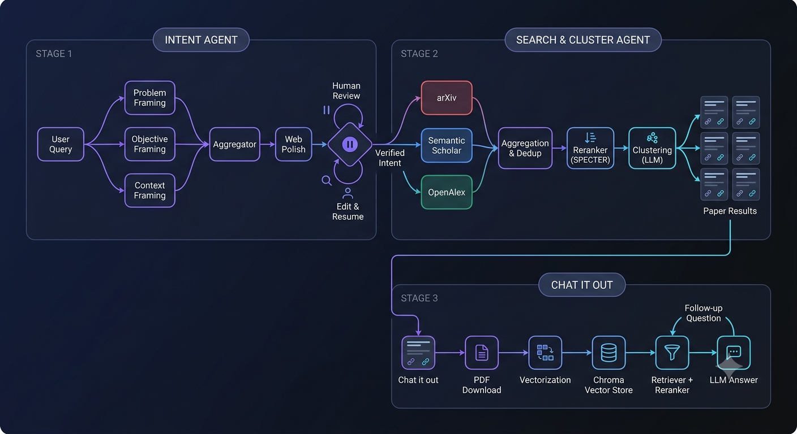

# NOVA — Research, guided by SONIC

NOVA is an agentic research assistant that takes a raw research idea through three
connected stages: intent formalization with human review, multi-source literature
search with semantic clustering, and per-paper conversational Q&A. SONIC is the
assistant persona presented to the user throughout the workflow.

---

## Architecture



---

## Pipeline

**Stage 1 — Intent Agent**
The user's raw idea is processed by three independent LLM calls, each with a
narrowly scoped task:
- **Problem** — the gap, limitation, or open issue implied by the query.
- **Objective** — the outcome the user wants, described independently of method.
- **Context** — constraints, known approaches, and scope, if stated.

These three outputs are merged into a single document by an aggregator node,
then passed through a web-polish node that runs a live Tavily search to correct
or sharpen terminology and named entities. Execution then pauses at an
`interrupt()` in the LangGraph checkpointer, and the polished intent is returned
to the user for review. Any edits are resumed into the same graph thread via
`Command(resume=...)`, producing the final verified Research Intent.

**Stage 2 — Search and Clustering Agent**
The verified Research Intent is converted into three separate queries, one per
academic API, each generated with that API's syntax in mind:
- **arXiv** — lexical, field-prefixed boolean query.
- **Semantic Scholar** — exact-match query with hedged synonym groups.
- **OpenAlex** — boolean query with quoted phrase grouping.

All three sources are queried in parallel. Results are deduplicated by
normalized title and merged into a single record per paper, preserving
per-source fields (citation counts, URLs) rather than overwriting them.
The merged set is reranked against the Research Intent using SPECTER paper
embeddings, and the top 15 results are passed to a clustering node, which
groups them by methodological approach using structured LLM output.

**Stage 3 — Chat It Out**
Each clustered result is presented as a paper card with title, authors, and
links. Selecting "Chat it out" on a paper triggers the following:
1. The paper's PDF is downloaded.
2. The PDF is parsed and split into section-aware chunks, with numeric/table
   content protected from mid-row splitting.
3. Chunks are embedded and stored in a Chroma vector store, cached by the
   PDF's content hash so repeat runs skip re-processing.
4. Questions are answered by retrieving the top 15 chunks by similarity,
   reranking them to the top 5 with a cross-encoder, and generating a
   grounded, page-cited response.

---

## Design Notes

| Component | Significance |
|---|---|
| Fan-out / fan-in in the Intent graph | Problem, Objective, and Context are drafted by independent LLM calls with strictly scoped prompts, rather than one prompt handling all three, which reduces cross-section bleed (e.g. a method appearing in the Objective). |
| Graph-level interrupt for human review | The graph suspends execution using LangGraph's checkpointer rather than simulating a pause in the UI layer. The edited text is resumed into the same execution thread, not re-run from scratch. |
| Per-API query generation | arXiv, Semantic Scholar, and OpenAlex have different query grammars (lexical, exact-match AND, boolean). Each query is generated by a prompt written for that API's specific behavior, rather than a single generic query applied everywhere. |
| SPECTER-based reranking | `allenai-specter` is trained on academic title/abstract pairs, making it better suited to judging paper-to-paper relevance than a general-purpose sentence embedding model. |
| Cross-source merge | Titles are normalized (Unicode folding, punctuation stripping) to detect the same paper across sources, and per-source fields are preserved in a dict rather than overwritten during merge. |
| Approach-based clustering | Papers are clustered by methodology rather than topic, since topical overlap is already guaranteed by retrieval. The clustering prompt uses the Objective to determine which methodological distinctions are relevant. |
| Section-aware chunking | PDFs are split by detected section headers first, with number-dense lines (tables) isolated into their own chunks before the recursive text splitter runs on remaining prose. |
| Retrieve-then-rerank for Q&A | Each query retrieves 15 candidates by embedding similarity, then reranks to the top 5 with a cross-encoder (`BAAI/bge-reranker-base`) before passing context to the LLM. |
| Per-run structured logging | Each node logs to `logs/{run_id}.log`, making a single query's full execution path — prompts, API queries, rerank scores — traceable independently of other concurrent runs. |

---

## Project Layout

```
NOVA/
├── nova_app.py                       # Streamlit UI and orchestration
├── app/                               # LangGraph agents
│   ├── core/logging_config.py                # per-run logging
│   └── modules/
│       ├── intent/graph.py                   # Stage 1
│       └── search/
│           ├── graph.py                      # Stage 2
│           ├── reranking.py                  # SPECTER reranker
│           └── providers/                    # arXiv, Semantic Scholar, OpenAlex clients
├── chatbot_core/
│   ├── vectorizeer.py                        # PDF chunking and vector store
│   └── Qa.py                                 # retrieval and answer generation
├── logs/                              # per-run logs
├── downloads/                         # PDFs fetched via "Chat it out"
├── vectorstores/                      # per-PDF Chroma stores, cached by content hash
├── requirements.txt
└── run.sh
```

`nova_app.py` is UI and orchestration only. It imports the compiled graphs and
chatbot functions and does not modify agent or chatbot logic.

---

## Tech Stack

| Layer | Technology |
|---|---|
| Orchestration | LangGraph (StateGraph, fan-out/fan-in edges, interrupt + checkpointer) |
| LLM | Groq — `openai/gpt-oss-120b` (agents), `llama-3.3-70b-versatile` (Q&A) |
| Web grounding | Tavily |
| Academic search | arXiv API, Semantic Scholar API, OpenAlex API |
| Reranking | `sentence-transformers/allenai-specter`, `BAAI/bge-reranker-base` |
| Embeddings | `BAAI/bge-base-en-v1.5` |
| Vector store | Chroma |
| PDF parsing | PyMuPDF |
| API layer | FastAPI |
| UI | Streamlit |

---

## Setup

```bash
pip install -r requirements.txt
./run.sh
# or directly:
streamlit run nova_app.py
```

Open the URL Streamlit prints (default `http://localhost:8501`).

Required environment variables (`.env`):

```
GROQ_API_KEY=
SECOND_GROQ_API_KEY=
TAVILY_API_KEY=
SEMANTIC_SCHOLAR_API_KEY=
OPENALEX_API_KEY=
OPENALEX_MAILTO=
```

---

## Limitations

- "Chat it out" requires a resolvable open-access PDF; papers without one show
  a disabled button rather than failing silently.
- The Intent graph's checkpointer (`MemorySaver`) is in-process, suitable for a
  single researcher on a single dev server. A persistent checkpointer
  (`SqliteSaver` / `PostgresSaver`) is required for multi-worker deployment.
- Clustering excludes papers with no abstract, since title alone is an
  insufficient signal for methodological grouping. These papers are still
  surfaced to the user, not dropped.
